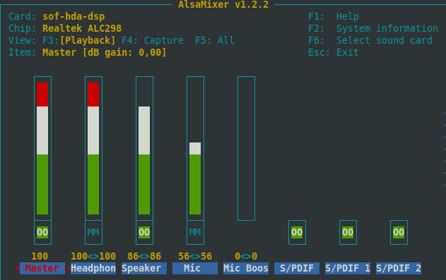

# How to Setup Audio Card in Samsung Galaxy Book

## Manual Steps
Install alsa-tools.
```bash
sudo apt install -y alsa-tools
```

Create or edit `/etc/modprobe.d/sof.conf` as root for adding the following line, then save and exit.
```bash
options snd slots=snd_soc_skl_hda_dsp
```

Create or edit `/etc/modprobe.d/blacklist.conf` as root for adding the following line, then save and exit.
```bash
snd-hda-intel
```

Rename alsa-base to backup.
```bash
sudo mv /etc/modprobe.d/alsa-base.conf /etc/modprobe.d/alsa-base.conf.backup
```

Move the file `TO912.sh` into your favorite location and set script permissions as read, write, executable for all.
```bash
sudo mv TO912.sh /opt/galaxy-book-audio/TO912.sh
sudo chmod a+rwx /opt/TO912.sh
```

Move ionsound.service into `/etc/systemd/system` and set file permissions to allow everyone to read.
```bash
sudo mv ionsound.service /etc/systemd/system
sudo chmod a+r /etc/systemd/system/ionsound.service
```

Move ionsoundsleep.service into `/etc/systemd/system/` and set file permissions to allow everyone to read.
```bash
sudo mv ionsoundsleep.service /etc/systemd/system/
sudo chmod a+r /etc/systemd/system/ionsoundsleep.service
```

Activate both new services.
```bash
sudo systemctl daemon-reload
sudo systemctl enable ionsound.service
sudo systemctl enable ionsoundsleep.service
```

Edit the file `/etc/pulse/default.pa` as root to turn off PulseAudio. Find the following line `load-module module-suspend-on-idle` and comment it out with `###`.
```bash
### load-module module-suspend-on-idle
```

Reboot the system, using `sudo reboot`.

Launch `alsamixer` in the terminal and modify volumes:
- press `F6`,
- ensure the sof-hda-dsp sound card is listed,
- select it,
- increase the volume in all the columns,
- ensure the db Gain (displayed at the top left corner) never exceeds 0.00



Click then the speaker icon in the systray and ensure the speaker is not muted, unmute it if it is. Moreover, ensure the Output drop-down has `Smart Sound Technology Audio Controller Speaker + Headphone`.

Finally, test the sound.

## Credits
Big thanks to drlucas to have published a comprehensive [tutorial](https://forum.manjaro.org/t/howto-set-up-the-audio-card-in-samsung-galaxy-book/37090).
